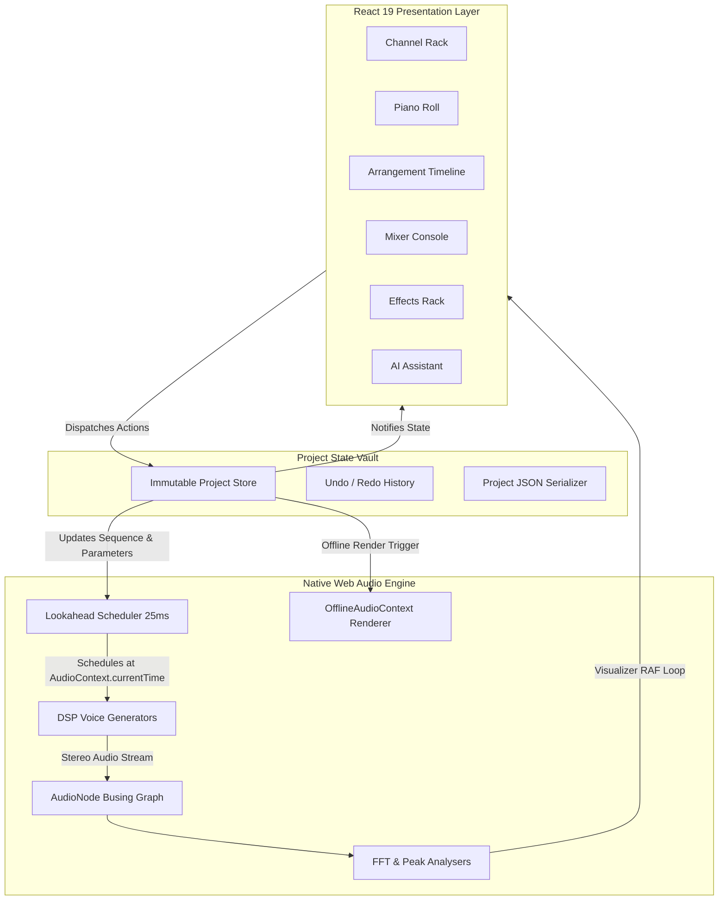

# 🍎 FIesta Studio

### The Open-Source Browser Digital Audio Workstation by Ferrivox

> **Make. Mix. Master. Anywhere.**

[](https://opensource.org/licenses/Apache-2.0)
[](https://www.typescriptlang.org/)
[](https://react.dev/)
[](https://www.w3.org/TR/webaudio/)
[](https://github.com/ferrivox)
[](CONTRIBUTING.md)

---

## 1. FIesta Studio
**FIesta Studio** is an open-source, high-performance browser-native Digital Audio Workstation (DAW) created by **Ferrivox**, an AI and technology company from Kigali, Rwanda. 

FIesta Studio delivers the workflow, speed, and tactile precision of desktop music software directly within the modern web browser—democratizing music production for creators, producers, and developers across Rwanda, Africa, and the entire globe without demanding expensive high-end desktop workstations.

---

## 2. Vision
Ferrivox believes advanced technology should solve real-world problems and make creative expression universally accessible:
> *"Build a powerful, accessible, browser-native music-production ecosystem where anyone can create, learn, collaborate, and experiment with music without being limited by expensive hardware or traditional desktop software."*

---

## 3. Why FIesta?
Traditional desktop DAWs are powerful, but they often impose heavy barriers: high license costs, gigabytes of bulky installers, platform lock-in (macOS/Windows), and steep hardware requirements.

FIesta Studio takes a radically open approach:
- **Zero Install:** Instant launch in any modern browser on Linux, ChromeOS, macOS, or Windows.
- **Pure Web Audio DSP:** Custom 32-bit floating-point audio engine with microsecond sample precision.
- **Rwandan & African Cultural Heritage:** First-class inclusion of traditional Rwandan instruments (Inanga, Amayugi, Intore drums) alongside modern genres (Amapiano, Afrobeats, Hip-Hop).
- **Controlled Open-Source Growth:** Built to evolve through international contributions while protecting the integrity of the core audio engine.

---

## 4. Features

### 🥁 Channel Rack / Step Sequencer
- 16 and 32-step polyrhythmic step sequencer grid.
- Acoustic drums, tuned 808s, Amapiano log drums, and shakers.
- Per-step velocity dials, swing timing, and live semitone pitch tuning.
- Instant groove presets for Amapiano, Afrobeats, and Trap.

### 🎹 Precision MIDI Piano Roll
- 88-key interactive canvas grid with virtual audition keyboard.
- Scale snapping: Major, Minor, Pentatonic, Blues, Dorian, and authentic **Rwandan Inanga Pentatonic**.
- Chord Assistant with 9th chords, Min9, Maj7, and Dom7 voicings.
- Note velocity curves and standard `.mid` MIDI file export.

### 🎚️ Multitrack Arrangement Timeline
- Non-destructive multitrack sequencer for Audio, MIDI, and Drum clips.
- Dynamic peak waveform rendering on audio clips.
- Snappable loop region boundaries, clip slicing, duplicating, and track mute/solo.

### 🎛️ Multitrack Mixer Console
- Dedicated channel strips with dB calibrated faders (-inf to +6 dB).
- Sub-bus architecture (Drums, Vocals, Instruments, Master).
- Stereo pan dials, mute toggles, and dedicated track solo buttons.
- Real-time stereo peak/RMS VU meters and 64-band FFT master spectrum analyzer.

### 🎚️ Studio Insert FX
- 3-band Parametric EQ with interactive frequency curve visualization.
- VCA Bus Compressor with dynamic gain-reduction meter.
- Algorithmic Hall Reverb with room size, damping, and wet/dry mix.
- Tempo-synced Stereo Ping-Pong Echo Delay.

### 🎙️ Live Audio Recording & Sample Vault
- Browser microphone recording directly onto timeline audio tracks.
- Rwandan Cultural Heritage Sound Archive with verified CC0 / Royalty-Free license metadata.
- Instant user audio sample upload (WAV, MP3, OGG) with native Web Audio decoding.

### 🤖 FIesta AI Co-Producer
- Server-side Google Gemini 2.5 generative music tool-calling engine.
- Generates structured drum patterns, chord voicings, and song arrangements into native project state.
- Full undo/redo and human artistic oversight.

---

## 5. Screenshots
*(UI preview captures will be hosted in `docs/assets/`)*

```text
+-------------------------------------------------------------------------------+
| FIesta Studio  [PLAY] [STOP] [REC]  BPM: [ 120 ]  BAR: [ 01.1 ]   [Ctrl+K]    |
+-------------------------------------------------------------------------------+
| [CHANNEL RACK]       [PIANO ROLL]       [ARRANGEMENT]       [MIXER CONSOLE]   |
| 16-Step Sequencer    88-Key MIDI Grid   Multitrack Clips    32-bit Bus Faders |
| Kick  [x . . . x .]  C4 [######]        [Drum Clip 1]       Track 1: -2.4 dB  |
| Snare [. . x . . .]  G3 [  ######]      [Inanga Mel]        Track 2: -6.0 dB  |
| LogDr [. x . x . x]  Eb [    ####]      [Vocal Hook]        Master:   0.0 dB  |
+-------------------------------------------------------------------------------+
| STATUS: 32-Bit Floating Bus | 44.1 kHz | DSP Load: 4% | Buffer: 25ms Lookahead|
+-------------------------------------------------------------------------------+
```

---

## 6. Demo
Experience FIesta Studio in your browser:  
🔗 **Live Application:** [FIesta Studio on AI Studio](https://ais-dev-lzi4oc33lb37rf7ht2ugv2-818203756832.europe-west2.run.app)

---

## 7. Architecture

FIesta Studio separates presentation, state management, and real-time audio computation into distinct, decoupled layers:



---

## 8. Technology Stack

- **Core Language:** [TypeScript 5.7+](https://www.typescriptlang.org/)
- **UI Framework:** [React 19](https://react.dev/)
- **Build Tooling:** [Vite 8](https://vite.dev/)
- **Styling:** [Tailwind CSS v4](https://tailwindcss.com/)
- **Audio Engine:** Pure Web Audio API (`AudioContext`, `OfflineAudioContext`, `AudioParam`)
- **Backend API:** [Express 4](https://expressjs.com/) on Node.js / `tsx`
- **AI Intelligence:** `@google/genai` (Google Gemini 2.5 Flash SDK)
- **Icons & Animation:** `lucide-react`, `motion`

---

## 9. Getting Started

### Prerequisites
- Node.js 18.0.0 or higher
- npm 9+ or pnpm or bun

### Installation
```bash
# Clone the repository
git clone https://github.com/ferrivox/fiesta-studio.git
cd fiesta-studio

# Install dependencies
npm install

# Setup environment variables
cp .env.example .env

# Start development server
npm run dev
```
Open your browser at `http://localhost:3000`. Click any step in the Channel Rack or press Spacebar to start the audio clock.

---

## 10. Development
```bash
# Type check and lint codebase
npm run lint

# Production build
npm run build

# Start production server
npm run start
```

---

## 11. Project Structure
```text
fiesta-studio/
├── .github/                     # GitHub workflows, issue templates, PR template
│   ├── ISSUE_TEMPLATE/
│   │   ├── bug_report.md
│   │   ├── audio_bug.md
│   │   ├── feature_request.md
│   │   └── documentation.md
│   ├── workflows/
│   │   └── ci.yml
│   └── PULL_REQUEST_TEMPLATE.md
├── docs/                        # Architectural documentation and guides
│   ├── architecture/            # Deep-dive subsystem architecture
│   ├── ai/                      # AI assistant & tool-calling architecture
│   ├── decisions/               # Architecture Decision Records (ADRs)
│   ├── development/             # Developer guide & environment setup
│   ├── licensing.md             # Third-party license audit & compliance
│   ├── internationalization.md  # i18n & translation framework
│   └── philosophy.md            # Project manifesto & design tenets
├── src/
│   ├── audio/                   # Native Web Audio DSP, scheduler, synth voices
│   ├── components/              # UI components (Mixer, PianoRoll, Timeline, etc.)
│   ├── engine/                  # State management, scale math, project store
│   ├── types/                   # Core TypeScript domain definitions
│   ├── App.tsx                  # Main DAW orchestrator & transport loop
│   └── index.css                # Tailwind CSS v4 entry point
├── server.ts                    # Backend API proxy for Gemini AI
├── LICENSE                      # Apache-2.0 License
├── NOTICE                       # Attribution & copyright notices
├── TRADEMARKS.md                # Trademark & branding policy
├── CREDITS.md                   # Full attribution for open-source & assets
├── CONTRIBUTORS.md              # Contributor roster & DCO info
├── MAINTAINERS.md               # Maintainer team & responsibilities
├── GOVERNANCE.md                # Governance model & RFC process
├── CONTRIBUTING.md              # Controlled contribution workflow
├── SECURITY.md                  # Vulnerability disclosure policy
├── CHANGELOG.md                 # Semantic version changelog
└── ROADMAP.md                   # Product & technology roadmap
```

---

## 12. Audio Engine
The FIesta Audio Engine uses a dual-timer **lookahead scheduler pattern**. JavaScript timers (`setInterval` / `requestAnimationFrame`) trigger every 25 milliseconds, scanning ahead 100ms into the future. All note activations and DSP parameter changes are scheduled using `audioContext.currentTime`, guaranteeing absolute sample precision regardless of main-thread CPU load.

Read the full deep dive in [docs/architecture/audio-engine.md](./docs/architecture/audio-engine.md).

---

## 13. AI Architecture
The FIesta AI Co-Producer interacts with project state strictly through **structured DAW tool calling**. Rather than generating raw unstructured text, Gemini 2.5 returns typed tool invocations (e.g., `setDrumPattern`, `addTrack`, `insertMidiNotes`, `setBpm`) that are validated against schemas before being dispatched to the project state.

Read the full architecture in [docs/ai/overview.md](./docs/ai/overview.md).

---

## 14. Plugin Architecture
Future synthesizer voices and audio effects will adhere to the **FIesta AudioWorklet Plugin Specification**, allowing third-party developers to package DSP algorithms that execute in dedicated audio worker threads.

Read the plugin specification roadmap in [docs/architecture/plugin-system.md](./docs/architecture/plugin-system.md).

---

## 15. Sample System & Provenance
Every audio sample included in FIesta Studio must carry rigorous provenance metadata:
- Unique identifier, name, and creator
- Verifiable license (CC0, Public Domain, or Royalty-Free Creative Commons)
- Source URL and attribution requirements

**We do NOT scrape commercial sound websites or redistribute copyrighted samples.**  
See [docs/licensing.md](./docs/licensing.md) for verification procedures.

---

## 16. Offline Architecture & Audio Export
FIesta Studio features an in-browser mastering and export pipeline built on `OfflineAudioContext`. When exporting a project, the engine renders all tracks, patterns, and insert effects faster than real-time and encodes the buffer directly into an uncompressed stereo WAV file (16-bit, 24-bit PCM, or 32-bit float).

Read more in [docs/architecture/export.md](./docs/architecture/export.md).

---

## 17. Performance Guidelines
- **Garbage Collection Discipline:** DSP routines avoid object allocation in audio loops.
- **Waveform Canvas Caching:** Arrangement timeline audio clips render waveform peaks once to an offscreen cache.
- **Spectrum Throttling:** FFT frequency visualizers throttle rendering to 60fps via `requestAnimationFrame`.

---

## 18. Roadmap
FIesta Studio follows an open roadmap divided into **NOW**, **NEXT**, **LATER**, and **VISION**.  
See [ROADMAP.md](./ROADMAP.md) for full details.

---

## 19. Contributing
Contributions follow a controlled, production-safe workflow:
```text
GitHub Issues ──► Discussion ──► Fork / Branch ──► Pull Request ──► CI Checks ──► Code Review ──► Merge
```
Read [CONTRIBUTING.md](./CONTRIBUTING.md) for branch guidelines, DCO sign-offs, and good first issues.

---

## 20. Code of Conduct
All contributors and participants must abide by the [Code of Conduct](./CODE_OF_CONDUCT.md) based on the Contributor Covenant v2.1. Instances of abusive behavior can be reported to `conduct@ferrivox.com`.

---

## 21. Security
Security vulnerabilities must be reported privately to `security@ferrivox.com`. Read our full [Security Policy](./SECURITY.md).

---

## 22. License
FIesta Studio source code is licensed under the **Apache License, Version 2.0**.  
See the [LICENSE](./LICENSE) file for the full license text.

---

## 23. Third-Party Licenses
Third-party libraries, dependencies, and sound assets are documented in [docs/licensing.md](./docs/licensing.md) and [NOTICE](./NOTICE).

---

## 24. Credits
Full acknowledgments for original engineering, open-source dependencies, sound designers, and cultural music researchers are recorded in [CREDITS.md](./CREDITS.md) and [CONTRIBUTORS.md](./CONTRIBUTORS.md).

---

## 25. Ferrivox
**Ferrivox** is an AI and technology initiative from Kigali, Rwanda.  
- **Motto:** *"Iron will, infinite dreams."*  
- **Mission:** Making world-class software, generative intelligence, and creative tools accessible to creators across the globe.  
- **Contact:** `contact@ferrivox.com`  
- **GitHub:** [https://github.com/ferrivox](https://github.com/ferrivox)
