# FIesta AI Architecture & Structured DAW Tools

The **FIesta AI Co-Producer** is an intelligent music assistant designed to accelerate arrangement, rhythm design, and melodic ideas while leaving 100% of artistic agency with the human producer.

---

## 1. Core Principle: AI Uses DAW Tools

FIesta AI does **NOT** generate opaque audio files or raw unstructured text paragraphs. Instead, it interacts with the DAW through **Structured Tool Invocations** that directly modify the project state:

```mermaid
flowchart LR
    UserPrompt[User Prompt in AIAssistant] --> ClientProxy[POST /api/ai/generate-producer-advice]
    ClientProxy --> Server[Express server.ts]
    Server --> Gemini[Google Gemini 2.5 Flash SDK]
    Gemini --> ToolCalls[Structured Function Tool Calls]
    ToolCalls --> Validation[Schema Validator]
    Validation --> ClientDispatch[Dispatch Mutations to Project State]
    ClientDispatch --> UIUpdate[Instant UI & Audio Update with Undo Support]
```

---

## 2. Structured DAW Tool Library

| Tool Name | Parameters | Action Description |
| :--- | :--- | :--- |
| `setDrumPattern` | `channelType: string, steps: boolean[], velocities: number[]` | Programs a custom 16 or 32-step drum pattern for kick, snare, log drum, or shaker |
| `setBpm` | `bpm: number` | Sets song tempo (40 to 240 BPM) |
| `addTrack` | `name: string, type: 'synth' | 'audio' | 'drums', color?: string` | Creates a new arrangement track routed to the appropriate mixer bus |
| `insertMidiNotes`| `trackId: string, clipId: string, notes: NoteEvent[]` | Writes melodic and chord note events into the designated piano roll clip |
| `setMixerLevels` | `trackId: string, volume: number, pan: number` | Adjusts channel strip balance and stereo positioning |
| `applyGenreGroove`| `genre: 'amapiano' | 'afrobeats' | 'trap'` | Configures typical tempo, swing factor, and drum rhythm foundations |

---

## 3. Server-Side Security & Key Isolation

To protect API credentials, browser clients never possess the `GEMINI_API_KEY`:
- Requests are sent to the local server endpoint `/api/ai/*`.
- `server.ts` uses `@google/genai` to initialize the client using secure server environment variables.
- Responses are sanitized and validated against project schemas before being sent back to the browser.
