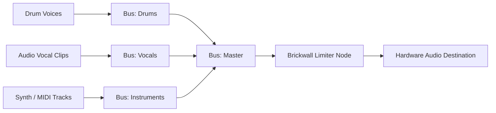

# Audio Engine Deep Dive

The FIesta Audio Engine (`src/audio/audioEngine.ts`) is a custom-engineered Web Audio runtime providing low-latency synthesis, sample playback, precision timing, and multi-bus mixing.

---

## 1. Web Audio Context Lifecycle

Web browsers require an explicit user gesture (click, tap, or key press) before audio playback is permitted:
- **Initialization:** An `AudioContext` is instantiated on first user interaction via `audioEngine.init()`.
- **State Handling:** If suspended by browser autoplay policy, `audioContext.resume()` is called automatically on play/record triggers.

---

## 2. Lookahead Clock Architecture

Rather than relying on inaccurate JavaScript intervals for audio events, the engine implements a dual-timer lookahead scheduler:

```text
Time Scale: ───────────────┬────────────────────────────┬─────────────►
                           ▲                            ▲
                 audioContext.currentTime     audioContext.currentTime + 100ms
                         [Now]                        [Lookahead Horizon]
                           │                            │
                           └───────── Scheduled ────────┘
```

- **Scheduler Interval:** 25 milliseconds.
- **Lookahead Window:** 100 milliseconds.
- **Musical Clock:** Calculated via `secondsPer16th = 60.0 / bpm / 4.0`.
- **Step Accumulator:** Advances fractional 16th-note steps and schedules drum hits or MIDI note activations precisely at `nextStepTime`.

---

## 3. Bus Routing Graph

FIesta features an internal 32-bit floating-point audio routing matrix:



Each bus contains:
1. `GainNode`: Calibrated volume level.
2. `StereoPannerNode`: Stereo positioning (-1.0 to +1.0).
3. `AnalyserNode`: 64-band FFT frequency analyzer and time-domain peak meter.

---

## 4. Solo & Mute Audition Logic

The audio engine enforces real-time audition routing:
- **Mute:** Immediately disconnects or zeros the gain for that track.
- **Solo:** When one or more tracks have `solo === true`, the lookahead scheduler and offline renderer automatically mute all other non-soloed tracks, ensuring seamless solo isolation during both live monitoring and final WAV export.
