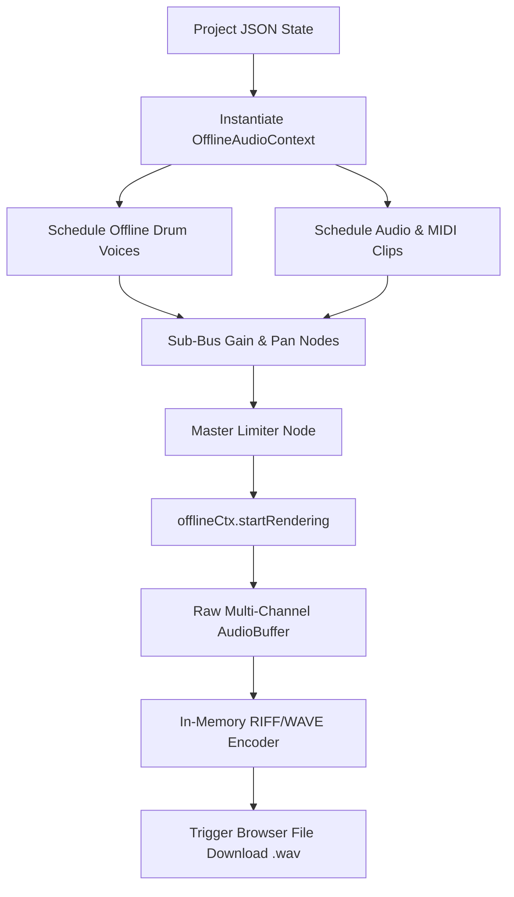

# Offline Audio Rendering & WAV Export

FIesta Studio includes an in-browser mastering and stem export engine built on the W3C `OfflineAudioContext` specification.

---

## 1. The Rendering Pipeline

Unlike real-time audio playback which renders at $1\times$ speed, `OfflineAudioContext` processes audio as fast as the device's CPU permits (often $10\times$ to $50\times$ faster than real-time) without risk of audio buffer dropouts.

---

## 2. RIFF WAVE Encoding Specification

The built-in encoder writes a standard binary RIFF header:
1. **Chunk ID:** `RIFF` (Bytes 0-3)
2. **Format:** `WAVE` (Bytes 8-11)
3. **Sub-chunk 1:** `fmt ` (16 bytes, PCM format `0x0001` or IEEE Float `0x0003`)
4. **Channels:** 2 (Stereo)
5. **Sample Rate:** 44,100 Hz or 48,000 Hz
6. **Bit Depth:** Supports 16-bit signed integer, 24-bit packed integer, or 32-bit floating point.
7. **Sub-chunk 2:** `data` containing interleaved Left/Right PCM audio samples.
