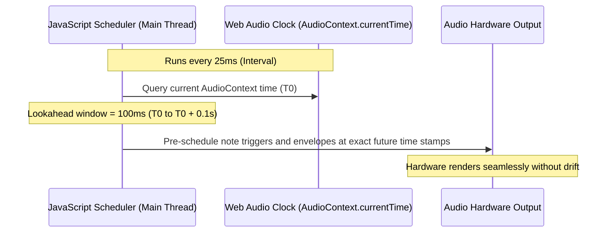

# High-Performance Browser Audio Engineering

Running a digital audio workstation inside a web browser poses unique real-time computing challenges. This document outlines the performance principles, audio thread isolation strategies, and rendering optimizations implemented in **FIesta Studio**.

---

## 1. The Real-Time Audio Constraint

In digital audio processing, missing an audio buffer deadline by even 1 millisecond causes an audible **buffer underrun** (perceived as clicks, pops, or audio dropout).

### The Browser Audio Threat: The Main Thread
In standard web applications, JavaScript execution, DOM layout calculations, garbage collection (GC), and user interactions share a single **Main Thread**. If a heavy React re-render or complex layout calculation delays the main thread by 50ms, traditional JavaScript timers (`setInterval`, `setTimeout`, `requestAnimationFrame`) will pause or drift.

---

## 2. The Lookahead Precision Scheduler

To achieve desktop-grade rock-solid timing on the main thread, FIesta Studio implements the **Lookahead Scheduler Pattern** (pioneered by Chris Wilson and the W3C Audio Working Group):

### Key Scheduler Parameters:
- **Scheduler Interval:** 25 ms (frequency of polling loops).
- **Lookahead Window:** 100 ms (how far into the future events are scheduled).
- **Time Base:** All note events, ADSR envelopes, and filter sweeps are scheduled strictly against `audioContext.currentTime`, which is hardware-clocked by the audio interface.

---

## 3. Garbage Collection (GC) Avoidance in Audio Routines

Garbage Collection pauses are the #1 cause of random audio clicks in browser audio applications.

### Optimization Rules:
1. **Zero Allocations in Playback Callbacks:**
   - Pre-allocate note event arrays, frequency lookup tables, and audio parameter objects.
   - Never instantiate new objects, closures, or large arrays inside the 25ms scheduler loop.
2. **Typed Arrays for Audio Buffers:**
   - Use `Float32Array` for sample buffers and waveform peak caches.
   - Reuse existing buffers when decoding audio chunks or computing FFT data.

---

## 4. Waveform Canvas Rendering Optimization

Drawing multitrack audio waveforms on an HTML5 `<canvas>` can quickly bottleneck the GPU/CPU if rendered naively on every frame:

- **Peak Decimation:** When audio is recorded or uploaded, the engine computes a downsampled peak cache (e.g., 2000 points per minute) rather than iterating through 44,100 samples per second.
- **Offscreen Canvas Caching:** Waveforms are drawn once to an offscreen bitmap buffer. During timeline panning and zooming, the cached bitmap is drawn using hardware-accelerated `ctx.drawImage()`.

---

## 5. Spectrum Analyzer & VU Meter Throttling

- **FFT Analyser:** The master channel uses a Web Audio `AnalyserNode` with `fftSize = 64`.
- **Throttling:** Canvas drawing is locked to `requestAnimationFrame` and automatically pauses when the browser tab is hidden or when playback is stopped.

---

## 6. Migration to AudioWorklet (Milestone v0.2.0)

While `AudioNode` chains currently handle playback, FIesta Studio is actively migrating synthesis voices to dedicated `AudioWorkletNode` processors:
- AudioWorklet runs on a dedicated, real-time priority OS audio thread.
- Completely immune to main thread UI freezes and tab throttling.
- Enables WebAssembly (WASM) DSP plugins written in C++ and Rust.
